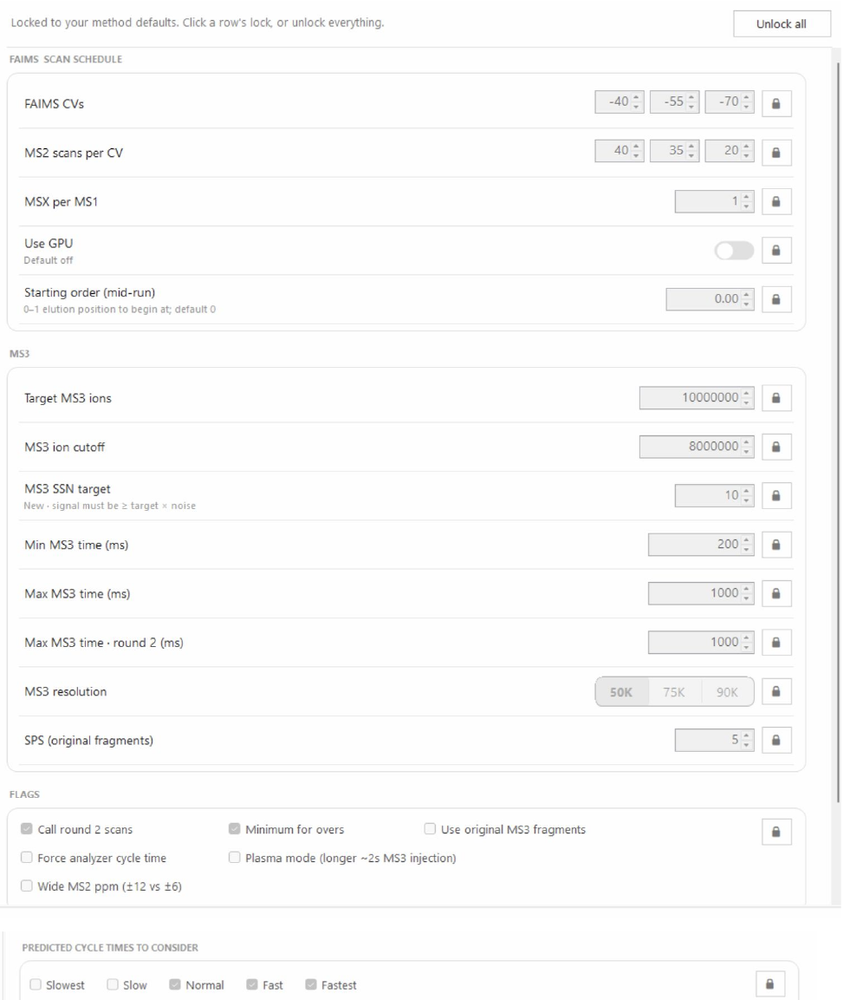

# Advanced

Review acquisition parameters and optional calling flags. The screenshot shows locked settings and an Unlock all control.

```{note}
Author draft. Fields marked **AUTHOR TODO** need confirmation against the released AIDA software. Screenshots show the supplied interface; they do not establish universal recommended settings.
```




## Step-by-step procedure

1. Record the Main-tab selections before changing advanced settings.
2. Locate the setting to change and use its lock control if required.
3. Change one documented parameter group at a time.
4. Review FAIMS, MS3 and cycle-time settings together for consistency.
5. Return to the method-generation workflow after confirming the intended configuration.

## Buttons and settings

| Control | Description | Details to complete |
|---|---|---|
| **Per-row locks / Unlock all** | Controls editability of settings. | **AUTHOR TODO:** Confirm which values unlock, whether this changes values, and how to restore defaults. |
| **FAIMS CVs** | Specifies the FAIMS compensation-voltage schedule. | **AUTHOR TODO:** Document units, permitted values, ordering and no-FAIMS behavior. |
| **MS2 scans per CV** | Sets the scan allocation associated with each CV. | **AUTHOR TODO:** Define how entries map to CVs and whether zero is permitted. |
| **MSX per MS1** | Acquisition setting labeled MSX per MS1. | **AUTHOR TODO:** Define MSX here and its relationship to MS1 scans. |
| **Use GPU** | GPU option; screenshot states default off. | **AUTHOR TODO:** List supported hardware/software and affected operations. |
| **Starting order (mid-run)** | Screenshot describes a 0–1 elution position, default 0. | **AUTHOR TODO:** Explain when a nonzero start is valid. |
| **Target MS3 ions** | MS3 ion target. | **AUTHOR TODO:** Define units and how the algorithm uses the target. |
| **MS3 ion cutoff** | MS3 ion threshold. | **AUTHOR TODO:** Define comparison, units and the effect of failing it. |
| **MS3 S/N target** | Screenshot states new signal must exceed target × noise. | **AUTHOR TODO:** Define signal/noise estimation and recommended values. |
| **Min MS3 time (ms)** | Minimum MS3 time setting. | **AUTHOR TODO:** Confirm injection-time semantics and allowed range. |
| **Max MS3 time (ms)** | Maximum MS3 time setting. | **AUTHOR TODO:** Explain scheduling constraints and allowed range. |
| **Max MS3 time – round 2 (ms)** | Separate maximum for the second round. | **AUTHOR TODO:** Define round 2 and when this value applies. |
| **MS3 resolution** | Resolution selector. | **AUTHOR TODO:** List supported choices by instrument. |
| **SPS (original fragments)** | Setting for original fragment selection. | **AUTHOR TODO:** Define count and selection rules. |
| **Call round 2 scans** | Second-round calling flag. | **AUTHOR TODO:** Explain eligibility and interaction with the round-2 time limit. |
| **Force analyzer cycle time** | Cycle-time flag. | **AUTHOR TODO:** Define the enforced constraint. |
| **Wide MS2 ppm** | Screenshot describes ±12 versus ±6. | **AUTHOR TODO:** Confirm affected tolerance and when this applies. |
| **Plasma mode** | Screenshot describes longer, approximately 2 s MS3 injection. | **AUTHOR TODO:** Confirm affected settings and supported use cases. |
| **Minimum for overs** | Visible optional flag. | **AUTHOR TODO:** Define this label and its effect. |
| **Use original MS3 fragments** | Fragment-selection flag. | **AUTHOR TODO:** Explain how it changes selected fragments. |
| **Predicted cycle times: Slowest, Slow, Normal, Fast, Fastest** | Selectable cycle-time scenarios. | **AUTHOR TODO:** Define each scenario and whether multiple selections are evaluated together. |

## Expected output

**AUTHOR TODO:** Explain whether changes persist between sessions and how to restore the validated configuration.

## Worked example

**AUTHOR TODO:** Add one real input filename, the settings used, an expected result and a screenshot of successful completion.

## Troubleshooting

**AUTHOR TODO:** Add a verified error message, its cause and recovery steps. See also [Troubleshooting](troubleshooting.md).
