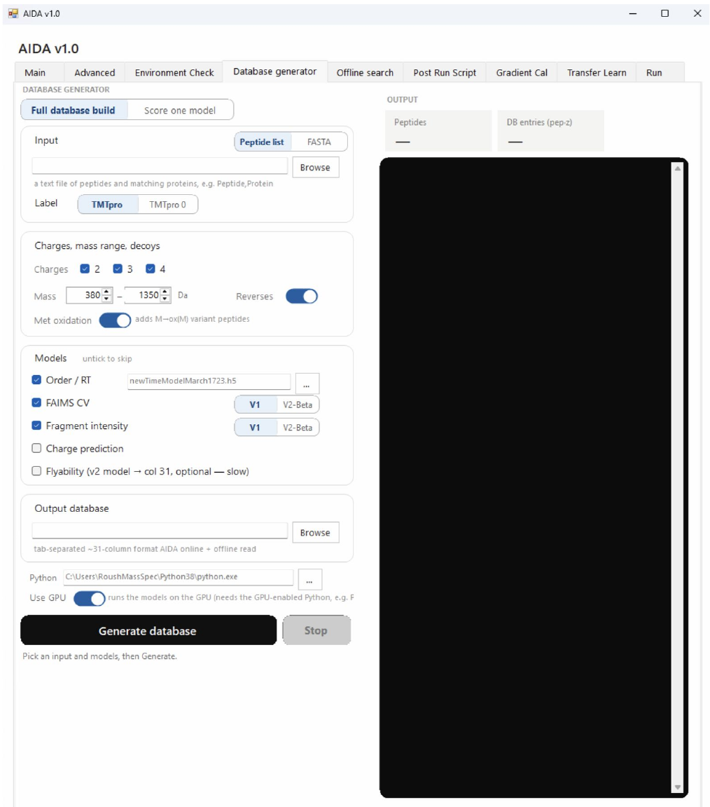

# Database Generator

Prepare the database used by AIDA from a peptide input and selected prediction settings.

```{note}
Author draft. Fields marked **AUTHOR TODO** need confirmation against the released AIDA software. Screenshots show the supplied interface; they do not establish universal recommended settings.
```




## Step-by-step procedure

1. Choose the database-build mode shown in your software release.
2. Browse to the input peptide list.
3. Select the label, precursor charges, mass range and decoy settings.
4. Select the required prediction models.
5. Choose the output database path.
6. Click **Generate database** and monitor the log.
7. Confirm completion and inspect the database before selecting it on Main.

## Buttons and settings

| Control | Description | Details to complete |
|---|---|---|
| **Build-mode selector** | Screenshot shows Full database build. | **AUTHOR TODO:** List all available modes and what each performs. |
| **Input peptide list / Browse** | Select the source peptide file. | **AUTHOR TODO:** Specify delimiter, headers, columns and modified-sequence notation. |
| **Label** | Select labeling configuration. | **AUTHOR TODO:** Confirm available labels and mass handling. |
| **Charge selectors** | Choose precursor charge states. | **AUTHOR TODO:** Specify valid range and whether peptides expand across charges. |
| **Mass range / decoy controls** | Controls under Charges, mass range, decoys. | **AUTHOR TODO:** Transcribe exact labels, units and decoy-generation behavior. |
| **Order / RT** | Elution-order/retention-time prediction option. | **AUTHOR TODO:** State model version, units and output column. |
| **FAIMS CV: V1 / V2-Beta** | FAIMS prediction model choices visible in the screenshot. | **AUTHOR TODO:** Explain model compatibility and recommended choice. |
| **Fragment intensity: model selectors** | Fragment-intensity prediction option. | **AUTHOR TODO:** Confirm exact version labels and supported modifications. |
| **Charge prediction** | Optional charge prediction. | **AUTHOR TODO:** Explain interaction with selected charge states. |
| **Flyability** | Optional model; screenshot mentions v2 and column 31. | **AUTHOR TODO:** Verify schema numbering and how predictions affect calling. |
| **Output database / Browse** | Set the output database location. | **AUTHOR TODO:** Specify filename extension and overwrite behavior. |
| **Generate database** | Starts database generation. | **AUTHOR TODO:** Document runtime expectations and completion message. |
| **Stop** | Stop control. | **AUTHOR TODO:** Confirm cancellation behavior and treatment of partial files. |

## Expected output

**AUTHOR TODO:** Provide a small validated example database, schema and expected precursor count.

## Worked example

**AUTHOR TODO:** Add one real input filename, the settings used, an expected result and a screenshot of successful completion.

## Troubleshooting

**AUTHOR TODO:** Add a verified error message, its cause and recovery steps. See also [Troubleshooting](troubleshooting.md).
