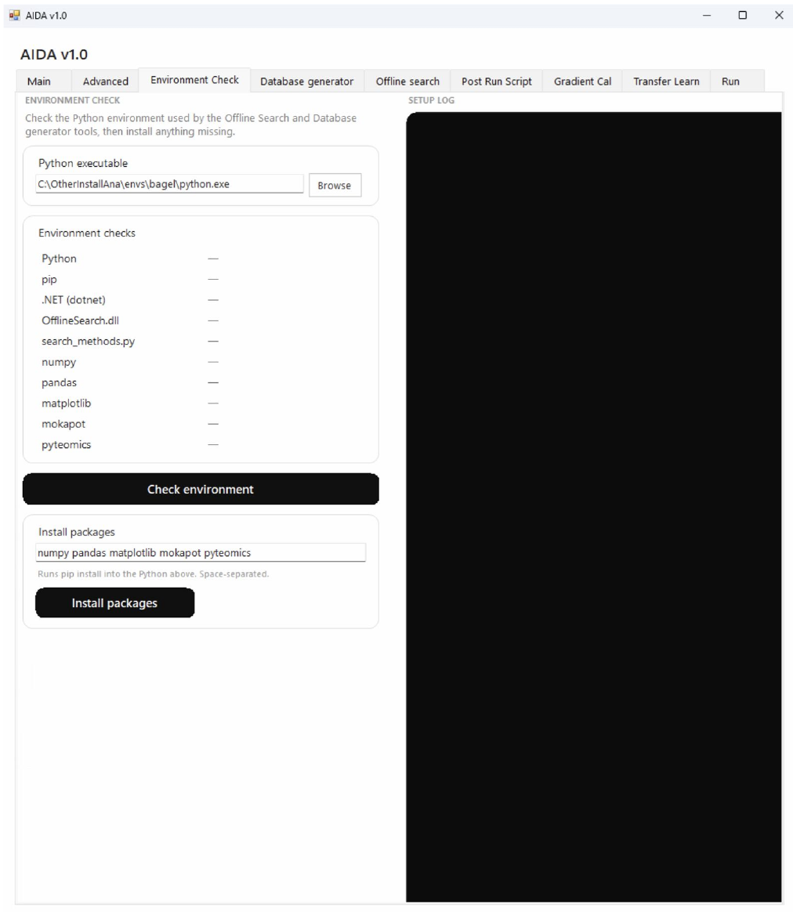

# Environment Check

Check the selected Python environment and other components listed by the application.

```{note}
Author draft. Fields marked **AUTHOR TODO** need confirmation against the released AIDA software. Screenshots show the supplied interface; they do not establish universal recommended settings.
```




## Step-by-step procedure

1. Click **Browse** beside **Python executable** and select the intended interpreter.
2. Click **Check environment**.
3. Review the component-status list and log.
4. If appropriate, use **Install packages** for missing Python packages.
5. Run the environment check again and confirm the required components are available.

## Buttons and settings

| Control | Description | Details to complete |
|---|---|---|
| **Python executable / Browse** | Select the interpreter used by the application. | **AUTHOR TODO:** Provide tested Python version and an example Windows executable path. |
| **Component-status list** | Lists Python, pip, .NET, OfflineSearch.dll, search_methods.py, numpy, pandas, matplotlib, mokapot and pyteomics. | **AUTHOR TODO:** Define each status symbol and identify mandatory versus optional components. |
| **Check environment** | Runs environment checks. | **AUTHOR TODO:** List checks and expected successful output. |
| **Package area / Install packages** | Interface for installing Python packages. | **AUTHOR TODO:** Confirm which packages install, the target environment and internet requirements. |
| **Log panel** | Displays diagnostic output. | **AUTHOR TODO:** Explain how to copy or save it. |

## Expected output

**AUTHOR TODO:** Add a screenshot of a successful check and a verified recovery procedure for each missing dependency.

## Worked example

**AUTHOR TODO:** Add one real input filename, the settings used, an expected result and a screenshot of successful completion.

## Troubleshooting

**AUTHOR TODO:** Add a verified error message, its cause and recovery steps. See also [Troubleshooting](troubleshooting.md).
