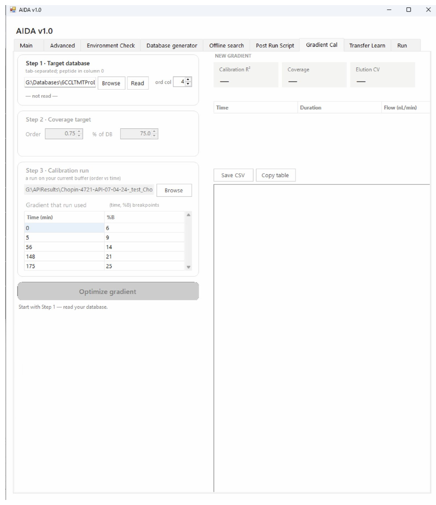

# Gradient Cal

Use a target database and a calibration run to prepare a new gradient program.

```{note}
Author draft. Fields marked **AUTHOR TODO** need confirmation against the released AIDA software. Screenshots show the supplied interface; they do not establish universal recommended settings.
```




## Step-by-step procedure

1. In **Step 1**, browse to the target database and click **Read order column** (confirm the exact label in the release).
2. Inspect the reported database information.
3. In **Step 2**, set the coverage target using the order and percentage controls.
4. In **Step 3**, select the calibration-run results.
5. Enter the gradient used for that run as time/%B breakpoints and complete duration/flow fields.
6. Run the calibration using the calculation control.
7. Review the new-gradient table, then use **Save CSV** or **Copy table** where appropriate.
8. Validate the proposed gradient before entering it into the LC method.

## Buttons and settings

| Control | Description | Details to complete |
|---|---|---|
| **Target database / Browse** | Database to cover with the proposed gradient. | **AUTHOR TODO:** Confirm tab-delimited format and peptide/order column positions. |
| **Read order column** | Reads database ordering information. | **AUTHOR TODO:** Confirm label and resulting summary. |
| **Order / % of DB** | Coverage-target controls. | **AUTHOR TODO:** Define scale, endpoints and their relationship. |
| **Calibration-run input / Browse** | Results used for gradient calibration. | **AUTHOR TODO:** Specify producer, columns and suitability requirements. |
| **Time (min) / %B table** | Gradient breakpoints used by the calibration run. | **AUTHOR TODO:** Define which loading, wash and equilibration points to include. |
| **Duration / Flow (nl/min)** | Timing and flow fields visible in the interface. | **AUTHOR TODO:** Define editable fields and time origin. |
| **Calculation control** | Computes the proposed gradient. | **AUTHOR TODO:** Confirm exact button name and enabled-state conditions. |
| **New-gradient table** | Displays proposed breakpoints. | **AUTHOR TODO:** Explain all columns, coverage diagnostics and fitting limitations. |
| **Save CSV / Copy table** | Exports or copies a table. | **AUTHOR TODO:** Confirm which table each control acts on and export format. |

## Expected output

**AUTHOR TODO:** Show a worked old/new gradient example, expected coverage, diagnostic acceptance criteria and instrument transfer instructions.

## Worked example

**AUTHOR TODO:** Add one real input filename, the settings used, an expected result and a screenshot of successful completion.

## Troubleshooting

**AUTHOR TODO:** Add a verified error message, its cause and recovery steps. See also [Troubleshooting](troubleshooting.md).
