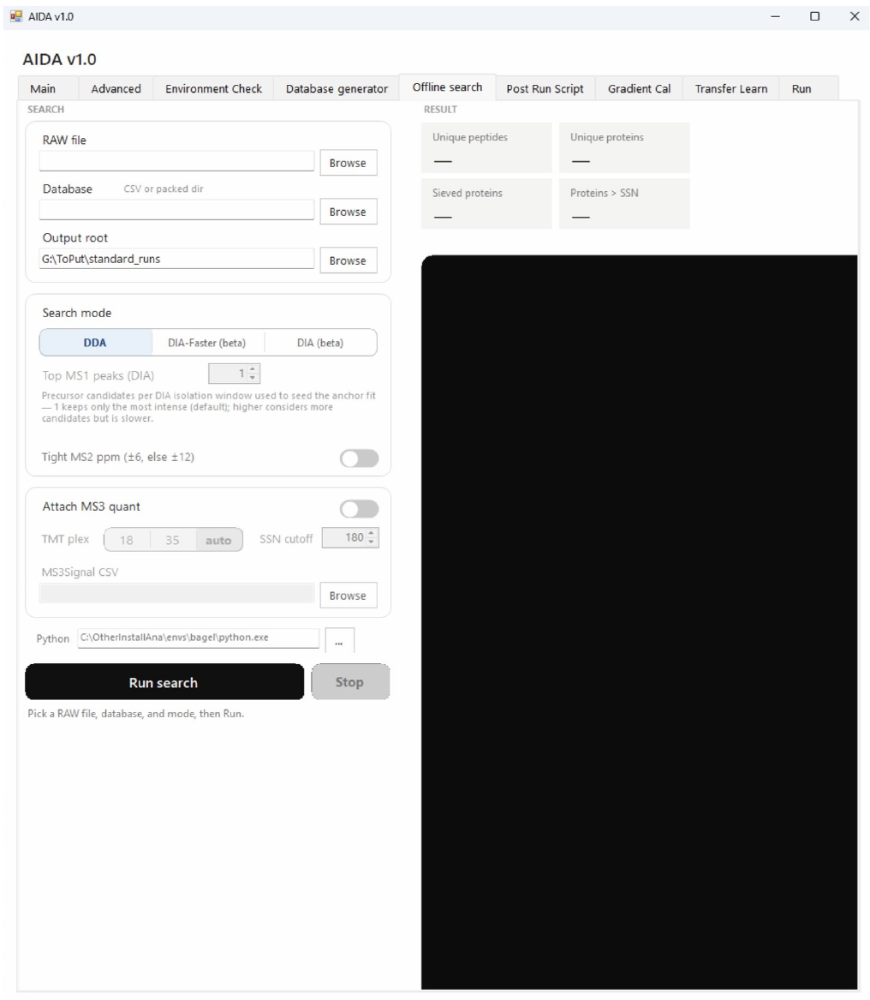

# Offline Search

Process an acquired raw file using a selected database and search configuration.

```{note}
Author draft. Fields marked **AUTHOR TODO** need confirmation against the released AIDA software. Screenshots show the supplied interface; they do not establish universal recommended settings.
```




## Step-by-step procedure

1. Select the RAW file.
2. Select the appropriate database.
3. Choose **Output root**.
4. Choose the search mode appropriate for the acquired data.
5. Set any mass-tolerance and MS3-quantification options required by the workflow.
6. Click the search/run control and monitor the log.
7. Check completion and identify the files needed for the next step.

## Buttons and settings

| Control | Description | Details to complete |
|---|---|---|
| **RAW / Browse** | Select raw data. | **AUTHOR TODO:** Confirm supported file types and whether multiple runs can be selected. |
| **Database / Browse** | Select search database. | **AUTHOR TODO:** Define compatibility with the acquisition database. |
| **Output root** | Set output location. | **AUTHOR TODO:** Explain directory structure and overwrite rules. |
| **Search mode: DDA / DIA-Faster (beta)** | Search-mode choices visible in the screenshot. | **AUTHOR TODO:** Explain the correct choice for AIDA acquisitions; these labels alone do not define the acquisition strategy. |
| **Mass-tolerance fields** | Additional search settings are visible. | **AUTHOR TODO:** Transcribe exact labels, units and validated defaults from the application. |
| **Attach MS3 quant** | Option for attaching MS3 quantification. | **AUTHOR TODO:** Define required inputs and resulting columns. |
| **Run search / Stop** | Execution controls. | **AUTHOR TODO:** Confirm exact labels, cancellation behavior and completion status. |
| **Log panel** | Search execution output. | **AUTHOR TODO:** Show a successful example and explain warnings. |

## Expected output

**AUTHOR TODO:** List identification and quantification files, score/FDR definitions, processing-engine versions and downstream consumers. Do not assume manuscript FDR settings are application defaults.

## Worked example

**AUTHOR TODO:** Add one real input filename, the settings used, an expected result and a screenshot of successful completion.

## Troubleshooting

**AUTHOR TODO:** Add a verified error message, its cause and recovery steps. See also [Troubleshooting](troubleshooting.md).
