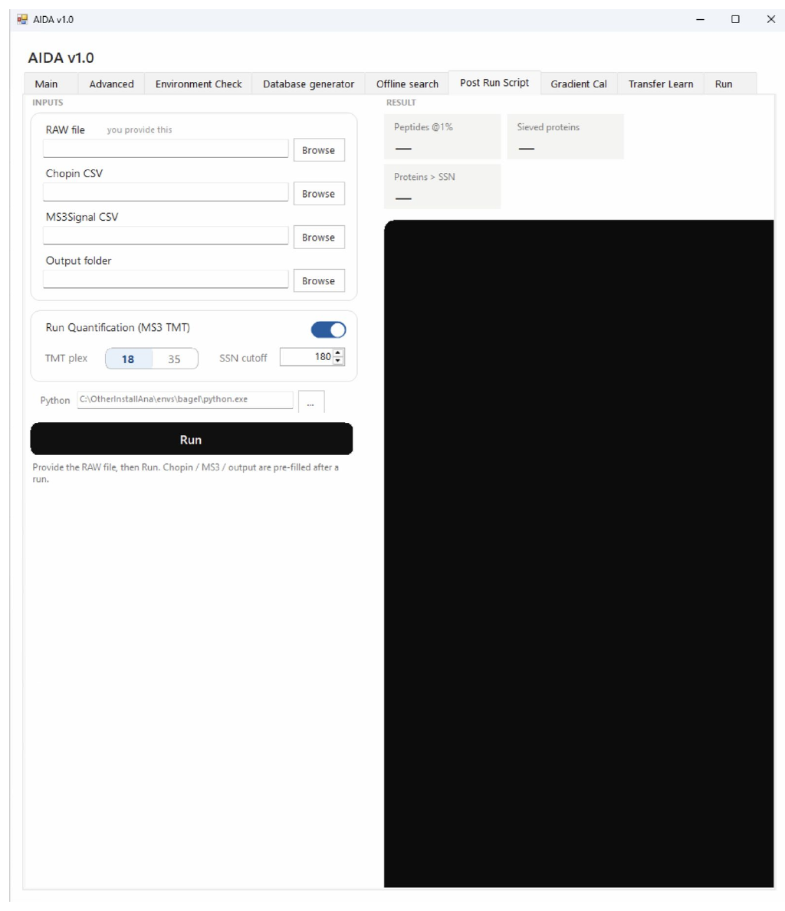

# Post Run Script

Configure post-run processing and the MS3 TMT quantification option.

```{note}
Author draft. Fields marked **AUTHOR TODO** need confirmation against the released AIDA software. Screenshots show the supplied interface; they do not establish universal recommended settings.
```




## Step-by-step procedure

1. Select the RAW input.
2. Choose **Chopin CSV** and **MS3Signal CSV**.
3. Select the output folder.
4. Set **Run Quantification (MS3 TMT)** as required.
5. Confirm any additional options and launch processing using the visible run control.
6. Review the log and inspect the resulting files.

## Buttons and settings

| Control | Description | Details to complete |
|---|---|---|
| **RAW / Browse** | Raw-data input. | **AUTHOR TODO:** Confirm supported inputs and matching rules. |
| **Chopin CSV / Browse** | Input labeled Chopin CSV. | **AUTHOR TODO:** Define the upstream generator and required columns. |
| **MS3Signal CSV / Browse** | Input labeled MS3Signal CSV. | **AUTHOR TODO:** Define its upstream generator, required columns and spectrum identifiers. |
| **Output folder / Browse** | Output location. | **AUTHOR TODO:** List filenames and overwrite behavior. |
| **Run Quantification (MS3 TMT)** | Quantification toggle visible in the screenshot. | **AUTHOR TODO:** Explain enabled and disabled behavior; distinguish this switch from execution. |
| **Additional quantification settings** | Additional fields appear below the toggle. | **AUTHOR TODO:** Transcribe current field names, ranges and defaults. |
| **Run control / log** | Execution area. | **AUTHOR TODO:** Confirm button label, inputs checked and completion message. |

## Expected output

**AUTHOR TODO:** Describe spectrum matching, reporter-channel order, any filtering or correction, and the resulting quantitative table.

## Worked example

**AUTHOR TODO:** Add one real input filename, the settings used, an expected result and a screenshot of successful completion.

## Troubleshooting

**AUTHOR TODO:** Add a verified error message, its cause and recovery steps. See also [Troubleshooting](troubleshooting.md).
