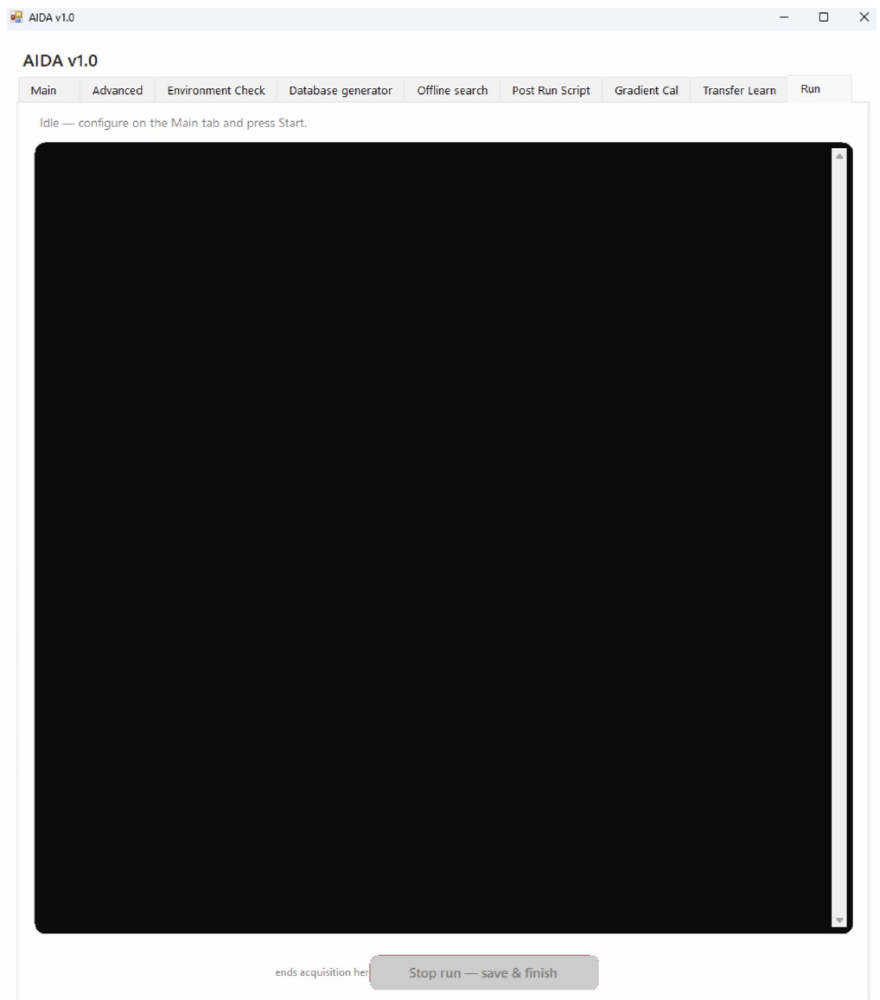

# Run

This screenshot shows a large console-like panel. Its exact role needs confirmation before publication.

```{note}
Author draft. Fields marked **AUTHOR TODO** need confirmation against the released AIDA software. Screenshots show the supplied interface; they do not establish universal recommended settings.
```




## Step-by-step procedure

1. Open the Run tab at the point specified in the completed workflow.
2. Review the active task and its output.
3. Check for the verified completion message.
4. Locate the output files and report any error with its surrounding log context.

## Buttons and settings

| Control | Description | Details to complete |
|---|---|---|
| **Console panel** | Large display area visible in the screenshot. | **AUTHOR TODO:** Confirm whether this monitors Main-tab execution or runs an independent operation. |
| **Execution controls** | No readable execution controls established by this screenshot. | **AUTHOR TODO:** Add current screenshot and exact button labels if present. |
| **Progress and status** | Status may be reported in the console. | **AUTHOR TODO:** Document completion, failure and cancellation indicators. |
| **Log export** | Not confirmed from screenshot. | **AUTHOR TODO:** State whether copy/save is supported and how. |

## Expected output

**AUTHOR TODO:** Confirm relationship to Main → Start, task lifecycle and log-file location.

## Worked example

**AUTHOR TODO:** Add one real input filename, the settings used, an expected result and a screenshot of successful completion.

## Troubleshooting

**AUTHOR TODO:** Add a verified error message, its cause and recovery steps. See also [Troubleshooting](troubleshooting.md).
