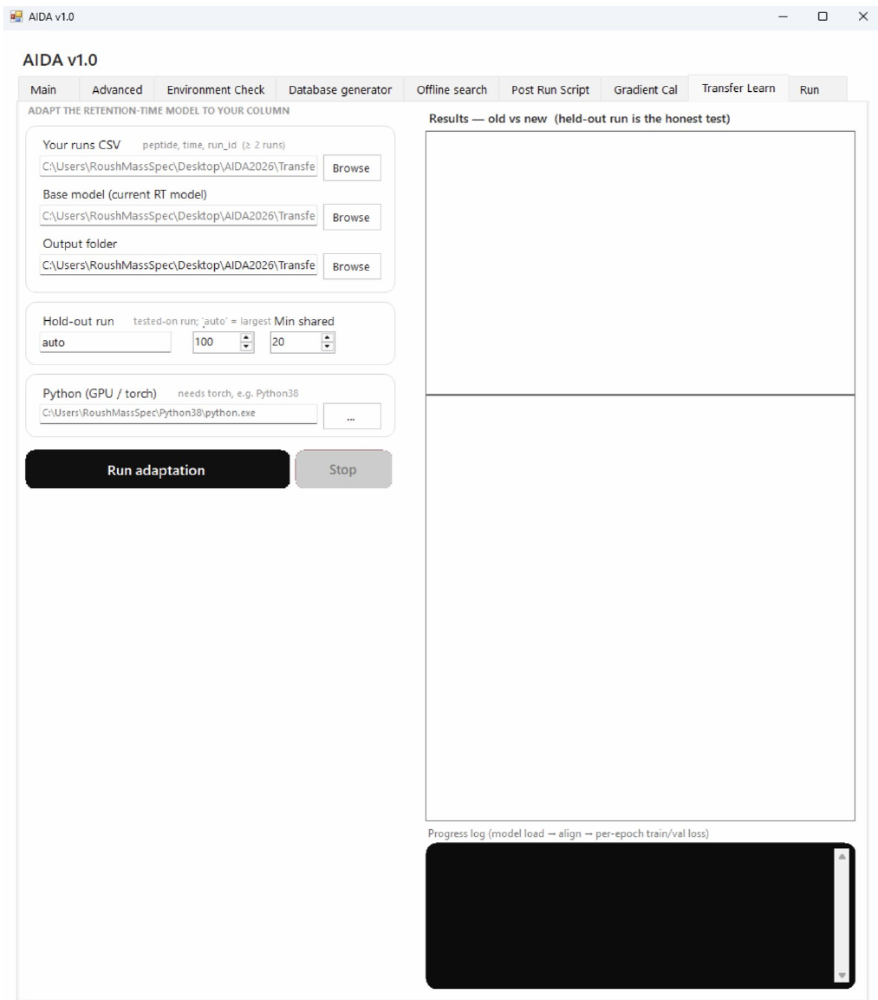

# Transfer Learn

Configure model adaptation and compare old and new performance. The screenshot explicitly distinguishes held-out-run results.

```{note}
Author draft. Fields marked **AUTHOR TODO** need confirmation against the released AIDA software. Screenshots show the supplied interface; they do not establish universal recommended settings.
```




## Step-by-step procedure

1. Supply the adaptation input files required by the released interface.
2. Choose the output folder.
3. Select the **Hold-out run** and **Min shared** setting.
4. Choose the Python environment supporting the required GPU/torch configuration.
5. Click **Run adaptation**.
6. Compare old and new results on the held-out run before deciding whether to use the adapted model.
7. Record the output model and how to select it for a subsequent database or method build.

## Buttons and settings

| Control | Description | Details to complete |
|---|---|---|
| **Adaptation inputs** | Input fields at the top of the tab. | **AUTHOR TODO:** Transcribe exact labels and required formats from the application. |
| **Output folder** | Destination for adaptation artifacts. | **AUTHOR TODO:** List files and original-model preservation behavior. |
| **Hold-out run** | Selects evaluation data excluded from fitting. | **AUTHOR TODO:** Confirm auto-selection logic and any exclusions. |
| **Min shared** | Minimum-shared setting. | **AUTHOR TODO:** Define what is shared, units and recommended threshold. |
| **Python (GPU / torch)** | Environment selection. | **AUTHOR TODO:** State tested hardware and dependencies. |
| **Run adaptation** | Starts model adaptation. | **AUTHOR TODO:** Specify which predictions/models are adapted. |
| **Stop** | Cancellation control. | **AUTHOR TODO:** Explain partial model/output handling. |
| **Results: old vs new** | Model comparison panel. | **AUTHOR TODO:** Define each metric, dataset split and acceptance criteria. |

## Expected output

**AUTHOR TODO:** Document trained-model files, metrics, split provenance and how the user activates or reverts the adapted model.

## Worked example

**AUTHOR TODO:** Add one real input filename, the settings used, an expected result and a screenshot of successful completion.

## Troubleshooting

**AUTHOR TODO:** Add a verified error message, its cause and recovery steps. See also [Troubleshooting](troubleshooting.md).
